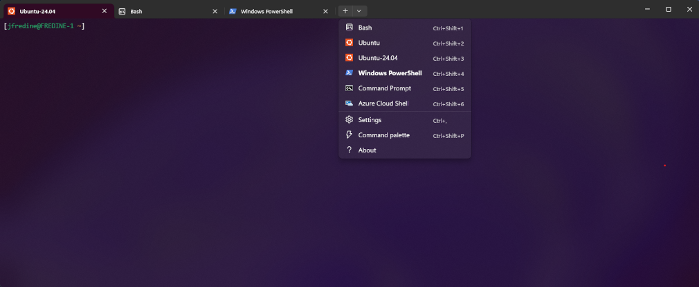
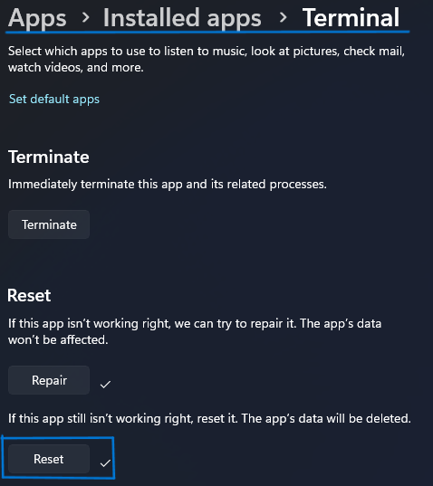
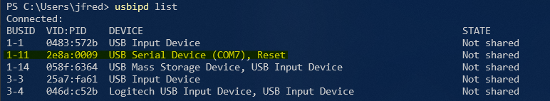
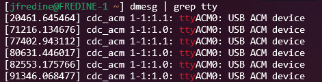
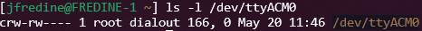
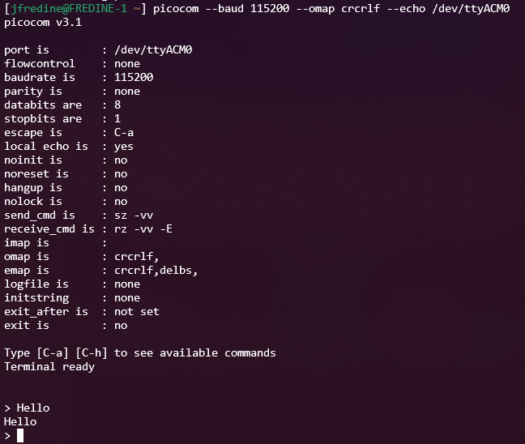
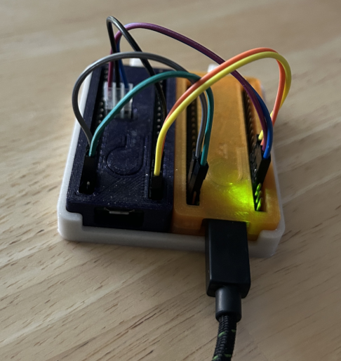
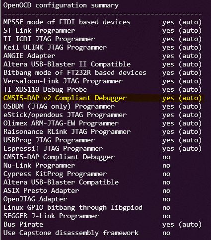
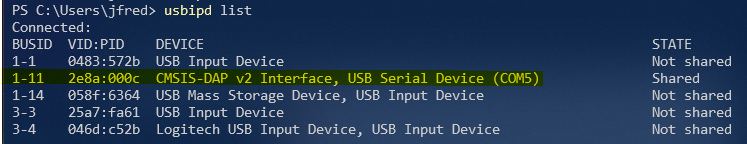

# Using Windows Subsystem for Linux (WSL) for Raspberry Pi Pico Development
## Why
Working in a Linux command line environment can be extremely efficient once
you learn it.  The abundance of useful tools such as grep and find as well as
powerful editors like vim make it very productive.  The learning curve is
steep, but the reward is well worth it.

While using Linux can be very productive, it may not be suited for all
compute tasks.  Windows is ubiquitous in the PC world and with its many
programs and utilities it may be impossible or at least very difficult
to replace it completely.  This is where the Windows Linux Subsystem
comes into the picture.  It allows you to run Linux inside Windows giving
you the best of both worlds.

## Enabling WSL
There are plenty of resources on the web describing how to enable WSL so
it will not be repeated here.
[These instructions](https://learn.microsoft.com/en-us/windows/wsl/install)
from Microsoft should work, but a search of the web will yield many other
resources.  There are many choices of Linux versions which can be installed,
but the scripts in this repository are created to run with Ubuntu and tested
with Ubuntu 24.04.  After installing a Linux distribution it should be
startable with the command `wsl -d <distribution>` or from the start menu.

The default Windows command console is rather antiquated and the use of a
more modern solution is recommended.  There are many choices, but the Windows
Terminal app is quite good with modern features like tabs, the ability
to run different shells in each tab (for instance bash, powershell, and
Linux running in different tabs), user settable color schemes, and the
ability to run tmux and screen for even more flexibility.

If not installed already on your system, it is available through the
Windows store.  If the new Linux installation is not shown as an available
shell in the terminal, try exiting the terminal and restarting.  If that
still does not work, try resetting the terminal in Settings.

## Setting up the Basics
### Download this repository

From within the WSL environment execute the following commands:

- `sudo apt update`
- `sudo apt install git`
- `git clone https://github.com/jfredine/wsl_pico_setup`

### Install the Raspberry Pi Pico SDK
To do C/C++ development for the Raspberry Pi Pico a minimum of four tool suites
are needed:

1. The [Arm GNU Toolchain](https://developer.arm.com/downloads/-/arm-gnu-toolchain-downloads)
2. The [Raspberry Pi Pico SDK](https://developer.arm.com/downloads/-/arm-gnu-toolchain-downloads)
3. The [Raspberry Pi picotool program](https://github.com/raspberrypi/picotool.git)
4. [CMake](https://cmake.org)

Additionally it is a good idea to download the
[Raspberry Pi Pico examples](https://github.com/raspberrypi/pico-examples.git)
to test the environment.

The utils/pico_sdk script will download, compile, and install all of these
tools and download the examples.  The script must be run as root in order to do
the installs.  E.g. `sudo wsl_pico_setup/utils/pico_sdk`.  All sources for the
tools and examples can be found in /usr/src.

### Build the Raspberry Pi Pico Examples
The build environment for the examples is created using cmake.  A typical
command sequence might look like:

- `mkdir build`
- `cd build`
- `export PICO_SDK_PATH=/opt/pico-sdk`
- `cmake -DPICO_BOARD=pico /usr/src/pico-examples  # adjust board type to pico_w, pico2, or pico2_w if necessary`

Any of the examples can now be compiled by changing to the example directory
within the build area and running Make.  The simplest example is blink and it 
would be compiled with the following commands.

- `cd blink`
- `make -j$(nproc)`

### Mount the Pico
The standard way to load a program onto the Pico is to boot it with the
BOOTSEL button pressed which makes it appear as a mass storage device in
Windows and then copy the .uf2 file onto the Pico.  When using WSL, the Pico
must additionally be mounted in the Linux file system after becoming visible in
Windows.  Microsoft has
[instructions](https://learn.microsoft.com/en-us/windows/wsl/wsl2-mount-disk)
for doing this.  It may be helpful to modify mount command provided by
Microsoft so that the new mount is owned by the user rather than root.  To do
this add the option `-ouid=$(whoami),gid=$(whoami)` to the mount command.
Once the Pico is mounted in Linux, the .uf2 file can simply be copied to the
file system and then reboot the Pico.

### Monitor Serial Communication
#### USB Device Sharing
In the case of the Raspberry Pi Pico, serial communication will usally
be done through the USB interface (either using Pico libraries or external
serial to USB converter).  Since windows USB devices are not visible in WSL
by default, an extra program, usbipd, needs to be used in Windows to expose
the USB device to WSL.  Microsoft has [instructions](https://learn.microsoft.com/en-us/windows/wsl/connect-usb)
describing the process.  The lsusb command in WSL is useful to check if the
pico has been properly exposed and can be installed with the command
`sudo apt install usbutils`.  The Pico will show up as a **`USB Serial Device`**
when listed with the usbipd program **IFF** the Pico is loaded with a program
using USB serial (e.g. hello/usb from the pico-examples) and connected to
Windows.

Once exposed to WSL, the Pico should be shown as **`Raspberry Pi Pico`** by the
lsusb program in WSL.

#### Locating the Serial Device in Linux
The command `dmesg | grep tty` will show recent activity for serial
ports and the Pico serial port should show up in the output.

In this case the device is ttyACM0.  Listing the permissions on that device
shows it is only accessible by root or users who are members of the dialout
group.

Adding the the user to the group (in this case dialout) is the easiest and
safest way to grant access to the serial port.  This is done using the command
`sudo usermod -a -G dialout $(whoami)`.  The user must log out and log back in
for the group addition to take effect.

#### Terminal Serial Monitor Program
Several options exist to monitor a serial port from the Linux command line
including screen, Minicom, dterm, picocom, and others.  Due to limitations in
which can do local character echo and which can translate carriage return to
carriage return and newline, the best choice is picocom.  It can be installed
with the command `sudo apt install -y picocom`.  The command
`picocom --baud 115200 --omap crcrlf --echo <device>` can then be used to
interact with the serial port.  A sample session with a program loaded in the
Pico which simply echos back the string sent to the Pico is shown below.

## Enabling Debug
Using a debug probe with the Raspbery Pi Pico is a significant productivity
booster.  It not only enables the use of a debugger with the Pico, but also
provides a way to directly load programs (ELF format) onto the Pico and reset
the Pico without the need to unplug and replug the USB cable.  As a consequence
there is no longer any need to generate .uf2 files since OpenOCD will load
.elf files directly.

The debug probe can be either a purpose built
[Raspberry Pi Debug Probe](https://www.raspberrypi.com/products/debug-probe/)
or a second Raspberry Pi Pico with debugprobe firmware loaded.  The process
for both methods is described in appendix A of the
[Getting started with Raspberry Pi Pico-series](https://datasheets.raspberrypi.com/pico/getting-started-with-pico.pdf)

pico2 W being debugged with a pico

### Build and Install OpenOCD
Building OpenOCD can be done with the instructions from Appendix A of the
[Getting started with Raspberry Pi Pico-series](https://datasheets.raspberrypi.com/pico/getting-started-with-pico.pdf)
but on WSL Ubuntu 24.04 it will require extra packages to be installed before
compiling using the following commands:

- `sudo apt update`
- `sudo apt install -y git libtool pkg-config make libusb-1.0.0-dev`

After the `./configure` step, you should see output similar to

Make sure the "CMSIS-DAP v2 Compliant Debugger" is enabled.

OpenOCD may be run from the build directory, but for convenience it is
recommended to install it with the command `sudo make install`.

### Share USB from Windows to WSL
As described above, USB devices in Windows must be shared in order for them to
be visible in WSL.  In the case of a Pico with debugprobe firmware loaded the
Pico will show as a **`CMSIS-DAP v2 Interface, USB Serial Device`** when listed.

### Scripts
A number of convenience scripts are available to help with the tasks of
starting the debugger, loading a program, and resetting the pico.  These
all require OpenOCD so will not work untill the debug environment has
been setup.

#### bin/pico_debug
The pico_debug script takes care of the tedious process of starting OpenOCD,
starting gdb, and then connecting gdb to the target.

    usage: pico_debug [-h] [-b {pico,pico_w,pico2,pico2_w}] file

    Start debugging a raspbery pi pico

    positional arguments:
      file                  File (ELF format) being debugged

    options:
      -h, --help            show this help message and exit
      -b {pico,pico_w,pico2,pico2_w}, --board {pico,pico_w,pico2,pico2_w}
                            Specify target board type

#### bin/pico_load
The pico_load script will load a .elf file into the Pico

    Usage: bin/pico_load [-b|--board pico|pico_w|pico2|pico2_w] <elf file>

#### bin/pico_reset
The pico_reset script will reset the Pico

    Usage: bin/pico_reset [-b|--board pico|pico_w|pico2|pico2_w]
